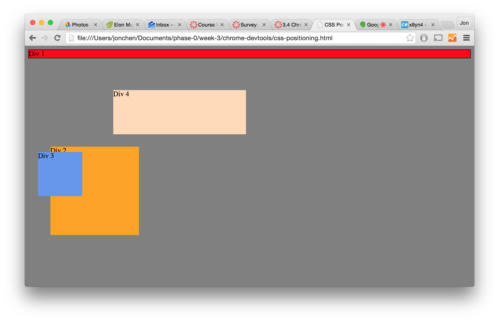
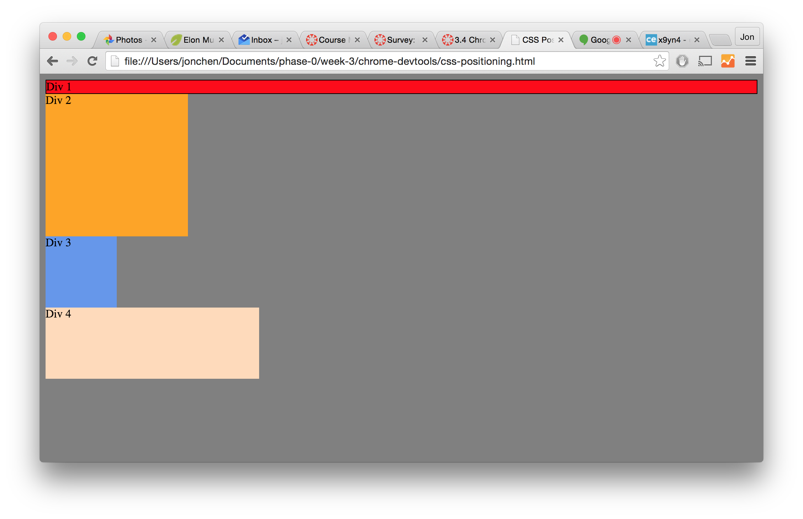
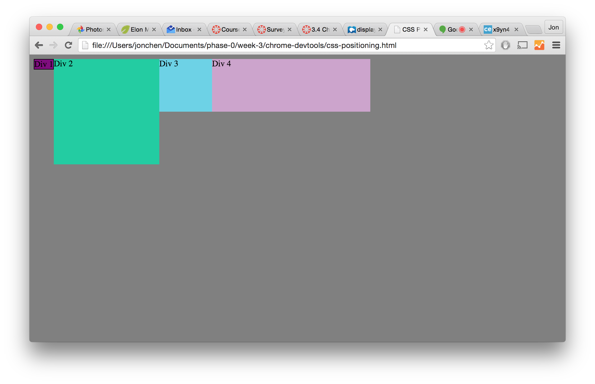
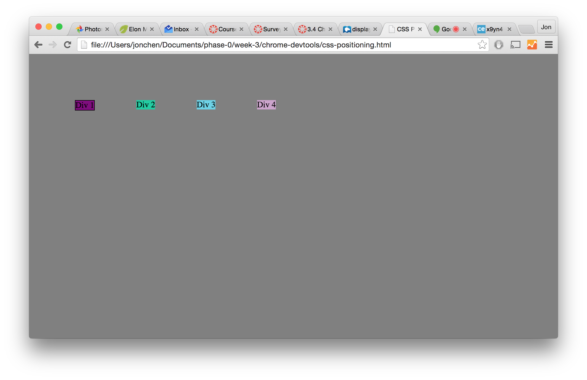
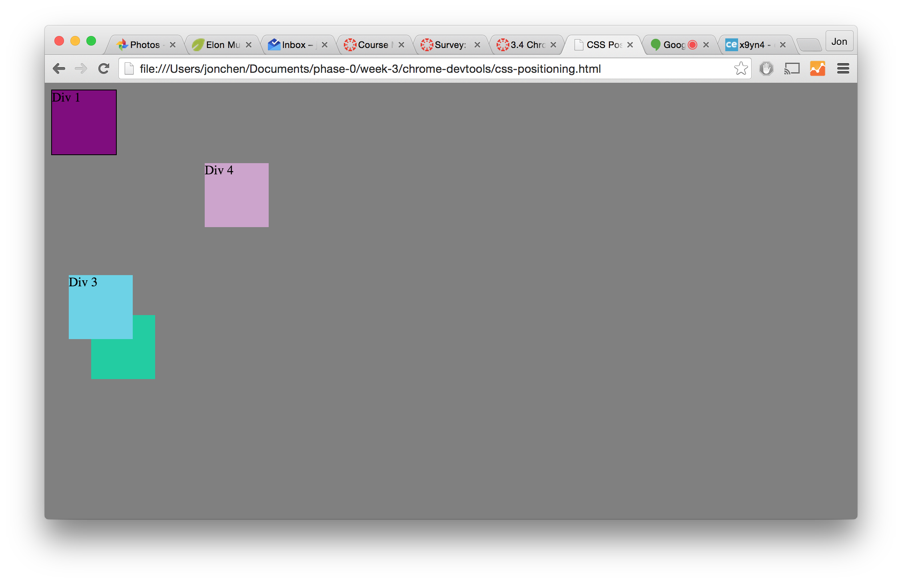
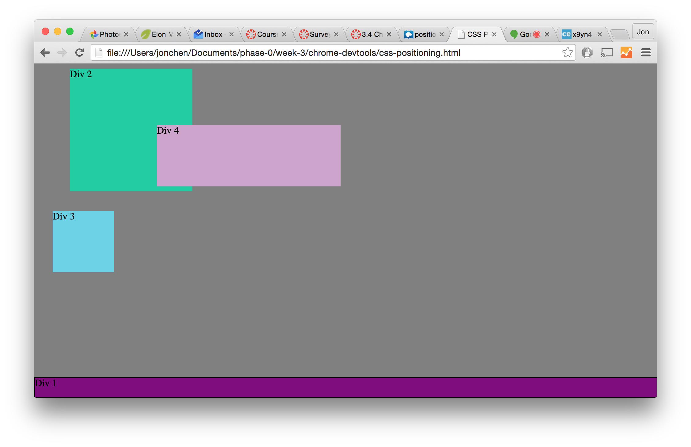
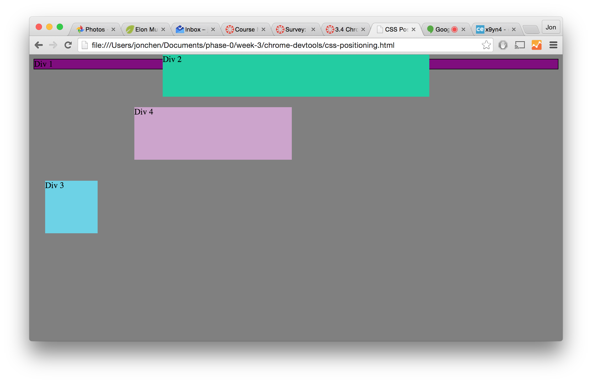
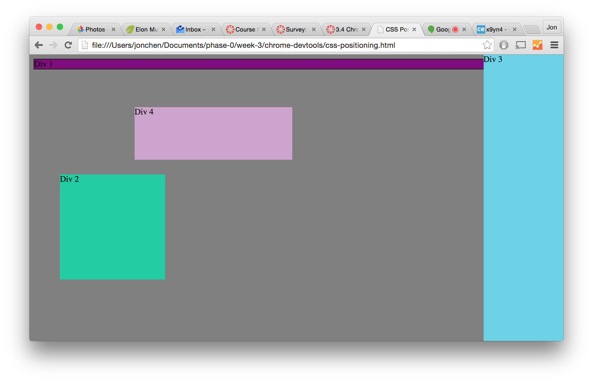
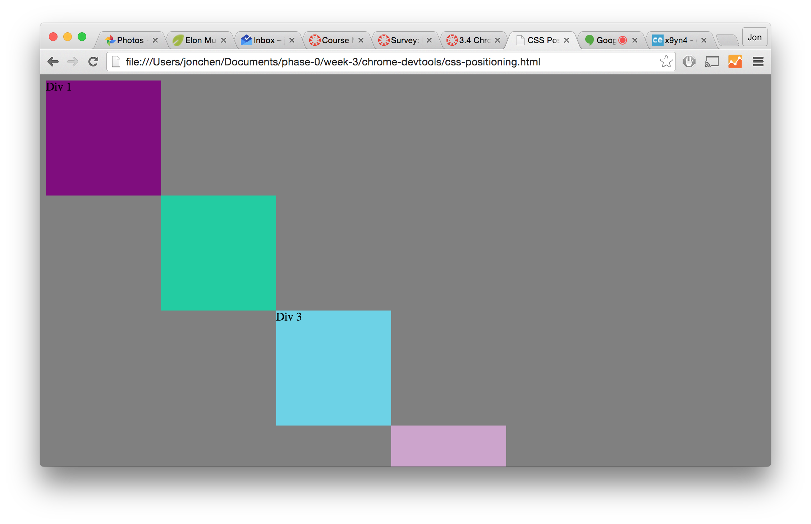

### How can you use Chrome's DevTools inspector to help you format or position elements?

Chrome's DevTools inspector helps highlight each of the elements in the DOM and shows their padding, margins etcetera. It also allows you to edit the HTML and CSS with live changes. This lets you see if changes in CSS change the layout to what you want it to be.

### How can you resize elements on the DOM using CSS?

Within the CSS stylesheets, you can create classes or adjust the style attributes: height, width, etc. of tags.

### What are the differences between Absolute, Fixed, Static, and Relative positioning? Which did you find easiest to use? Which was most difficult?

Static is the default, where each element show in the order they are documented.
Relative makes the element relative to it's static position.
Fixed makes the element relative to the browser window.
Absolute makes the element positioned relative to the first positioned (but not static) parent.

I find fixed the easiest to use since it represents what we see in the browser window and you don't have to trace back the ancestry of the element. The absolute position is hardest to use for me since you have to understand what the first positioned parent to it is and make it's positioning relative to that. 

### What are the differences between Margin, Border, and Padding?

The content is surrounded by padding, which is surrounded by the border, which is surrounded by the padding.

### What was your impression of this challenge overall? (love, hate, and why?)

This challenge was interesting. It was nice to play around with CSS with simple rectangles on a page and moving them around. It was frustrating at points, but worth it to help engrain the different methods of shaping elements in the DOM.
