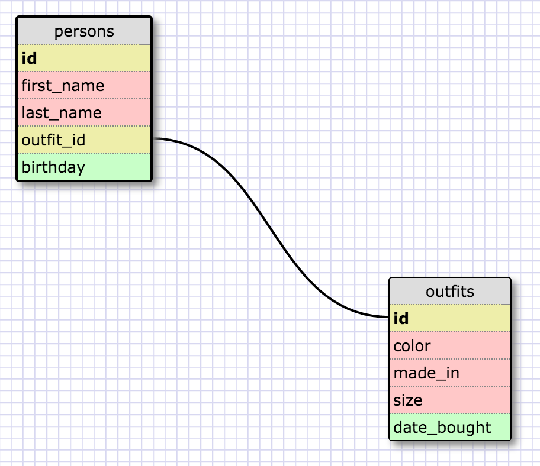

### What are databases for?

Databases allow you to store data in seperate tables that can have relationships.

### What is a one-to-many relationship?

A one-to-many relationship is where one object can have many of another object. I.e., a person can have many cars.

### What is a primary key? What is a foreign key? How can you determine which is which?

The primary key is a unique ID in a table that allows you to reference it. A foreign key is a primary key of another table that you use for reference. Primary keys will usually have the name "id" while foreign keys will be "something_id".

### How can you select information out of a SQL database? What are some general guidelines for that?

You would use the SELECT command like so: SELECT * FROM objects. This shows all the items with the * wildcard in the table "objects." Alternatively, you can put a column heading instead of * for more specificity. 
